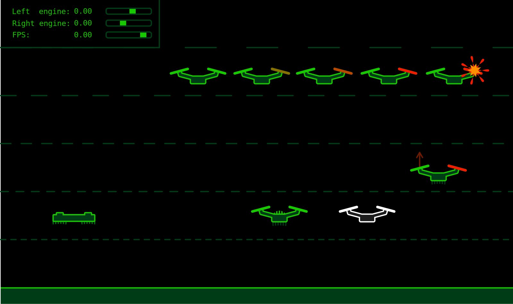

# README #

### What is this repository for? ###

* This repository is a simple drone simulation project. A drone with an AI module, that is responsible for the right angle of the drone. A user can control the drone's target angle, which lets the user to control the flight direction. 
It is possible to choose an AI module: Fuzzy logic, Nerual network, PID Controller, No AI

* Created by
* Milosz Glowaczewski
* Szymon Gesicki
* Jedrzej Glowaczewski
* version 1.0.0

### How do I get set up? ###

* Installation
    `pip install -r requirements.txt`
* choose the type of artificial intelligence ( fuzzy_logic or neuron_network or simple_ai ) with a command line argument ai (1-Fuzzy logic, 2-Neural network, 3-PID, 4-Manual) e.g. `python main.py -ai 1`

### Controll ###

* key up -> temporary engine start: perpendicular direction
* key right/left -> move right, move left
* key r -> creating a new drone that can be controlled
* key q/esc -> exit the program

